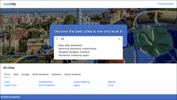
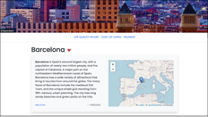
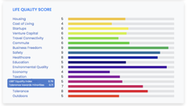
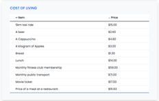
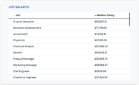
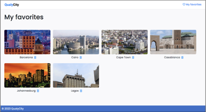

# QualyCity
QualyCity is a web application that allows users to learn about the quality of life in various cities around the world. If you want to know more details, watch this [video](./docs/qualycity.mp4).

## Features

- City search
    - Autocomplete search
    - Continent filtering
- City information
    - General information
    - Geographical location
    - Life quality Score, Cost Of Living and Job Salaries
- Manage favorites cities

## Screenshots

